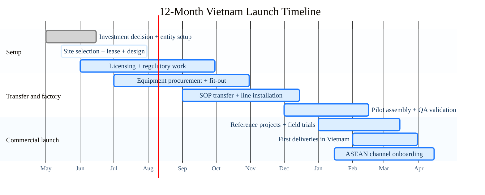

# ASEAN UAV Manufacturing Base

Ho Chi Minh City, May 2026

A Vietnam manufacturing base that extends an existing China drone platform into Vietnam and the wider ASEAN market.

- **Investment Ask**  
  `5-8M USD`  
  To launch a Vietnam assembly, testing, and service base
- **12-Month Target**  
  `Factory commissioned`  
  First deliveries in Vietnam and pilot ASEAN channels live
- **First Full-Year Revenue**  
  `8M USD`  
  Built on proven platforms, local assembly, and service revenue

---
layout: two-cols
class: thesis
layoutClass: thesis-layout
---

## Why This Expansion Makes Sense

> Not a replacement for China. A second base for ASEAN.

Vietnam gives your group a lower-risk way to expand regional drone manufacturing without rebuilding core capability from zero.

### Why it works

- **Reuse existing platform**  
  Transfer mature drone models, QA discipline, and supplier know-how
- **Vietnam cost + access**  
  Competitive labor, industrial zones, and faster local market entry
- **ASEAN commercial bridge**  
  Serve Vietnam first, then expand into nearby regional channels
- **Risk diversification**  
  Add a second operating base outside a single-country footprint

::right::

---
class: dual-map
---

## Vietnam Hub Strategy

Southern Vietnam is the right base for final assembly, testing, localization, and ASEAN distribution because it combines ports, airports, supplier density, and outbound reach in one operating zone.

### Southern Vietnam Cluster

### ASEAN Reach

---
layout: two-cols
class: business
layoutClass: business-layout
---

## Operating Model

A staged China-plus-Vietnam model reduces startup risk, shortens time to market, and builds regional upside in phases.

### Model highlights

- **Phase 1: transfer and assemble**  
  Core modules from China, final assembly and QA in Vietnam
- **Phase 2: local service revenue**  
  Maintenance, training, spare parts, batteries, and support contracts
- **Phase 3: regional scale-up**  
  Vietnam localization, channel partners, and software or data upsell

::right::

  

    
Operating Architecture

    

      

        <strong>China Platform</strong>
        core modules, qualified suppliers, SOPs, and QA templates
      

      
↓

      

        <strong>Vietnam Base</strong>
        final assembly, testing, localization, after-sales, and service
      

      
↓

      

        <strong>ASEAN Channels</strong>
        Vietnam first, then regional distributors and service partners
      

    

  

  

    
Execution Sequence

    

      

        <strong>1</strong>
        Transfer BOM, tooling, and QA templates from China
      

      

        <strong>2</strong>
        Install line, train team, and localize assembly workflow
      

      

        <strong>3</strong>
        Validate pilot builds with local testing and reference projects
      

      

        <strong>4</strong>
        Scale sales, service, and channel coverage across ASEAN
      

    

  

---
class: factory-gantt
---

## 12-Month Launch Plan

Target outcome: **a commissioned Vietnam base in 12 months, with first deliveries completed and the first full operating year targeted near 8M USD**

---
class: roadmap
---

## 5-Year Growth Roadmap

1. **Year 1 · Commission the Vietnam base**  
   Legal setup, line install, pilot assembly, and first customer deliveries  
   `Milestone: factory live`
2. **Year 2 · Prove the Vietnam model**  
   Reference customers, service network, and stable domestic operations  
   `Milestone: repeatable domestic sales`
3. **Year 3 · Scale ASEAN exports**  
   Cambodia, Thailand, Indonesia, and nearby partner channels  
   `Milestone: export mix 30-40%`
4. **Year 4 · Improve margin and recurring revenue**  
   More localization, maintenance plans, training, and software contracts  
   `Milestone: stronger operating economics`
5. **Year 5 · Run a dual-base regional platform**  
   Vietnam as ASEAN hub, China as core platform and supply anchor  
   `Milestone: export-led regional manufacturing`

---
layout: two-cols
class: capital
---

## Capital Plan

> **5-8M USD**  
> To open a de-risked Vietnam manufacturing base built on an existing China drone platform.

### Funding focus

- **Factory + line setup**  
  `2-3M`
- **Working capital + imported kits/components**  
  `1.5-2.5M`
- **Team, certification, and channel build**  
  `1.5-2.5M`

::right::

### First-year revenue logic

  

    
Illustrative Year-1 Revenue Mix

    

      60%
      20%
      10%
      10%
    

    

      

        
        <strong>Hardware</strong>
        Main platform revenue
      

      

        
        <strong>Service</strong>
        maintenance, training, support
      

      

        
        <strong>Software</strong>
        data, workflow, value-added tools
      

      

        
        <strong>Parts + batteries</strong>
        spares, accessories, replacement cycles
      

    

  

Around `8M USD` in the first full operating year, with revenue anchored by hardware and margin expansion supported by service, software, and recurring parts demand.

---
class: closing
---

# Thank You 谢谢

We welcome your questions and next-step discussion on the Vietnam manufacturing base opportunity.

欢迎继续交流，并讨论越南制造基地项目的下一步合作。
