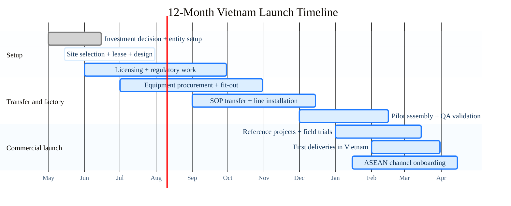

# ASEAN UAV Manufacturing Base

Ho Chi Minh City, May 2026

A Vietnam manufacturing base that extends an existing China drone platform into Vietnam and the wider ASEAN market.

- **Investment Ask**  
  `5-8M USD`  
  To launch a Vietnam assembly, testing, and service base
- **12-Month Target**  
  `Factory commissioned`  
  First deliveries in Vietnam and pilot ASEAN channels live
- **First Full-Year Revenue**  
  `8M USD`  
  Built on proven platforms, local assembly, and service revenue

---
layout: two-cols
class: thesis
layoutClass: thesis-layout
---

## Why This Expansion Makes Sense

> Not a replacement for China. A second base for ASEAN.

Vietnam gives your group a lower-risk way to expand regional drone manufacturing without rebuilding core capability from zero.

### Why it works

- **Reuse existing platform**  
  Transfer mature drone models, QA discipline, and supplier know-how
- **Vietnam cost + access**  
  Competitive labor, industrial zones, and faster local market entry
- **ASEAN commercial bridge**  
  Serve Vietnam first, then expand into nearby regional channels
- **Risk diversification**  
  Add a second operating base outside a single-country footprint

::right::

---
class: dual-map
---

## Vietnam Hub Strategy

Southern Vietnam is the right base for final assembly, testing, localization, and ASEAN distribution because it combines ports, airports, supplier density, and outbound reach in one operating zone.

### Southern Vietnam Cluster

### ASEAN Reach

---
layout: two-cols
class: business
layoutClass: business-layout
---

## Operating Model

A staged China-plus-Vietnam model reduces startup risk, shortens time to market, and builds regional upside in phases.

### Model highlights

- **Phase 1: transfer and assemble**  
  Core modules from China, final assembly and QA in Vietnam
- **Phase 2: local service revenue**  
  Maintenance, training, spare parts, batteries, and support contracts
- **Phase 3: regional scale-up**  
  Vietnam localization, channel partners, and software or data upsell

::right::

---
class: factory-gantt
---

## 12-Month Launch Plan

Target outcome: **a commissioned Vietnam base in 12 months, with first deliveries completed and the first full operating year targeted near 8M USD**

---
layout: two-cols
class: ops
---

## Execution Model

> **China + Vietnam split**  
> China provides platform leverage and supplier depth. Vietnam provides local execution and ASEAN access.

::right::

### Operating responsibilities

- **China base**  
  Platform design, core electronics, QA templates, and supplier network
- **Vietnam base**  
  Final assembly, testing, localization, field service, and customer delivery
- **Local team 120-150 people**  
  Production, engineering support, business development, and back office
- **Commercial sequence**  
  Agriculture and industrial inspection first, then ASEAN distributors and partners

---
class: roadmap
---

## 5-Year Growth Roadmap

1. **Year 1 · Commission the Vietnam base**  
   Legal setup, line install, pilot assembly, and first customer deliveries  
   `Milestone: factory live`
2. **Year 2 · Prove the Vietnam model**  
   Reference customers, service network, and stable domestic operations  
   `Milestone: repeatable domestic sales`
3. **Year 3 · Scale ASEAN exports**  
   Cambodia, Thailand, Indonesia, and nearby partner channels  
   `Milestone: export mix 30-40%`
4. **Year 4 · Improve margin and recurring revenue**  
   More localization, maintenance plans, training, and software contracts  
   `Milestone: stronger operating economics`
5. **Year 5 · Run a dual-base regional platform**  
   Vietnam as ASEAN hub, China as core platform and supply anchor  
   `Milestone: export-led regional manufacturing`

---
layout: two-cols
class: capital
---

## Capital Plan

> **5-8M USD**  
> To open a de-risked Vietnam manufacturing base built on an existing China drone platform.

### Funding focus

- **Factory + line setup**  
  `2-3M`
- **Working capital + imported kits/components**  
  `1.5-2.5M`
- **Team, certification, and channel build**  
  `1.5-2.5M`

::right::

### What this unlocks in 24 months

- **Factory commissioned**  
  Vietnam assembly, QA, testing, and service base
- **Commercial proof**  
  Reference customers in Vietnam and first ASEAN channel partners
- **Strategic value**  
  A second manufacturing base for your group outside China
- **Financial target**  
  Around `8M USD` in the first full operating year

---
layout: two-cols
class: market
---

## Why This Is Attractive to Your Group

### Strategic fit

- **Extend, not replace China**  
  Keep core platform and supplier strengths where they already work
- **Open Vietnam faster**  
  Local presence improves hiring, customer trust, and market access
- **Build ASEAN optionality**  
  Vietnam becomes the bridge into nearby regional channels
- **Create valuation upside**  
  A dual-base model is stronger than a single-country manufacturing footprint

::right::

### Risk control

- **Start with proven platforms**  
  No need to fund product invention from zero on day one
- **Localize in stages**  
  Begin with transfer and assembly, then deepen sourcing over time
- **Validate with reference customers**  
  Win early proof before committing aggressive scale capex
- **Keep supply flexibility**  
  Use China supply depth first and expand local sourcing selectively
