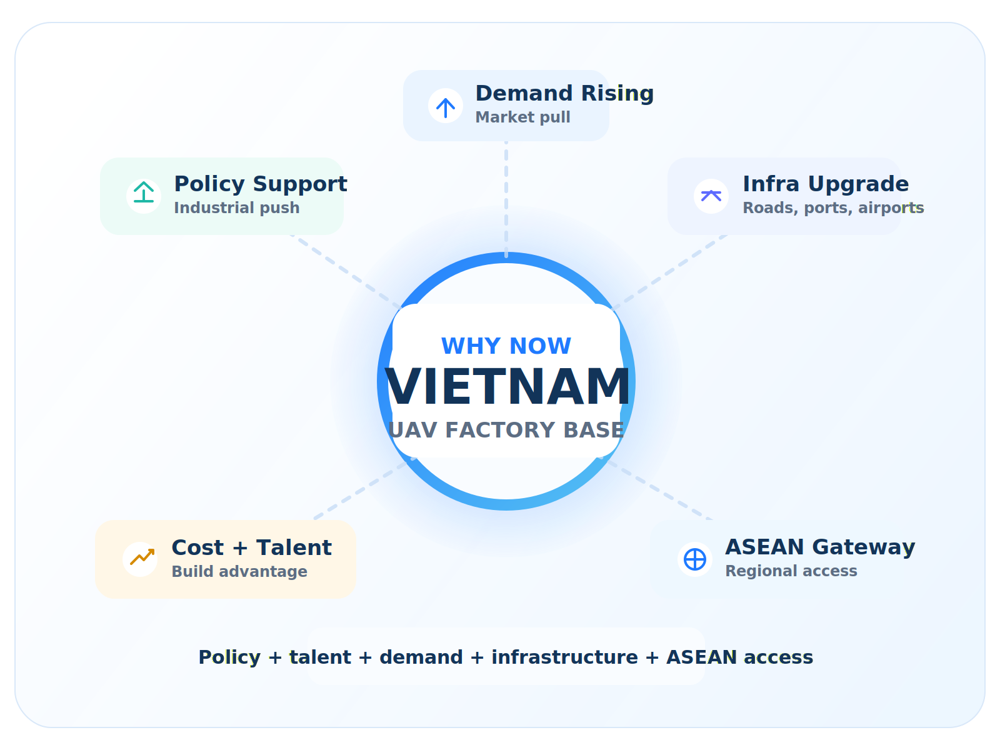
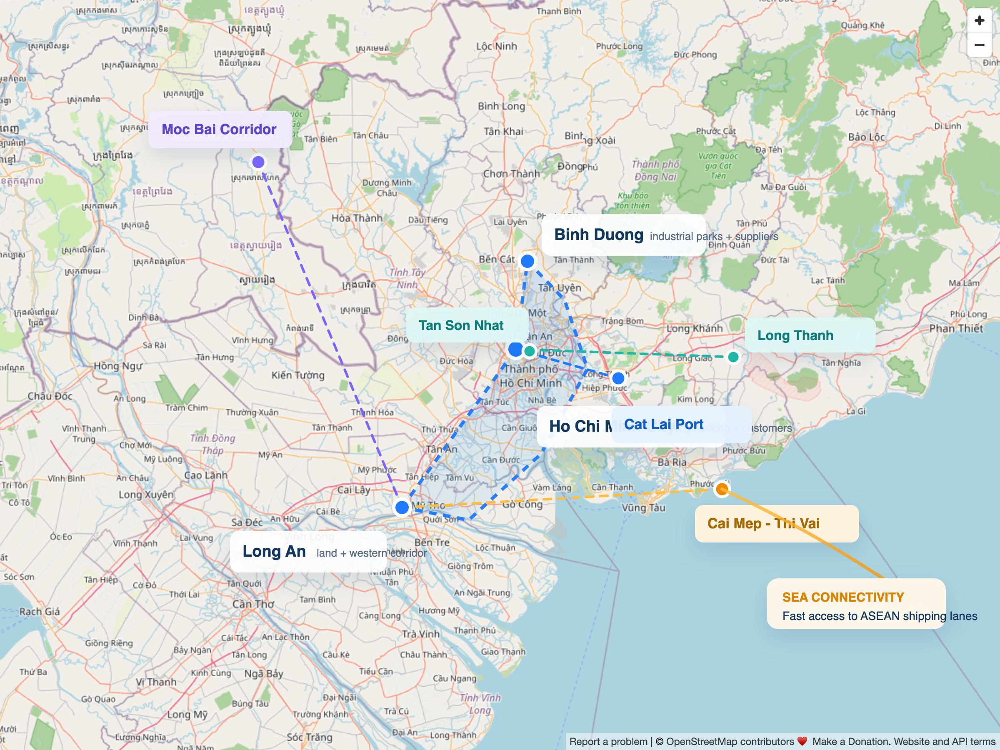
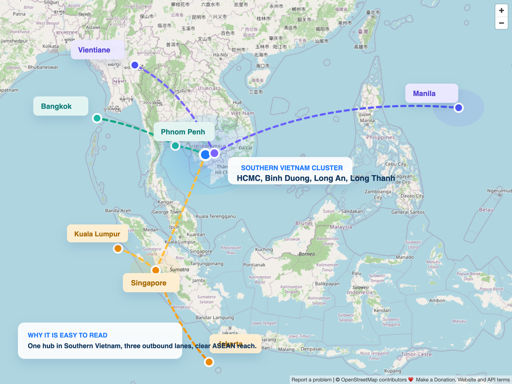
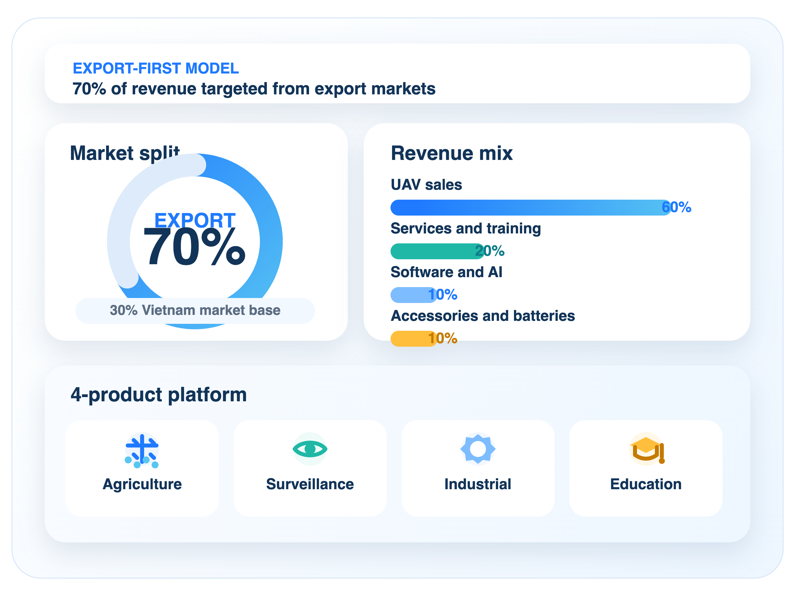
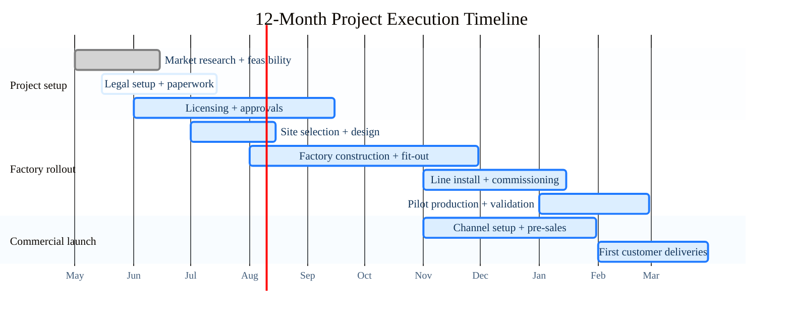

# UAV Manufacturing

Ho Chi Minh City, May 1, 2026

A modern civilian UAV manufacturing platform for agriculture, industry, rescue operations, and education.

- **Year 1 Revenue**  
  `8M USD`  
  Around 1,200 UAV units at roughly 6,500 USD ASP
- **Growth Target**  
  `20% / year`  
  Scaling toward 13.8M USD by year 4
- **Break-even**  
  `18-24 months`  
  Supported by product, service, and software revenue

---
layout: two-cols
class: thesis
layoutClass: thesis-layout
---

## Why This Project

> Right project. Right market. Right timing.

Vietnam concentrates the five key conditions for a UAV factory into one market.

### Why it works

- **Policy support**  
  National industry alignment
- **Cost + talent**  
  Affordable build + skilled labor
- **Demand gap**  
  Demand grows beyond local supply
- **ASEAN launchpad**  
  Fast route into regional markets

::right::

---
class: dual-map
---

## Factory Master Plan

Southern Vietnam works as the manufacturing base inside Vietnam and the gateway into ASEAN, so the local logistics cluster and regional reach should be shown together.

### Southern Vietnam Cluster

### ASEAN Connectivity

---
layout: two-cols
class: business
layoutClass: business-layout
---

## Business Model

A scalable UAV platform built to win export markets first.

### Model highlights

- **70% export target**  
  Regional markets drive the revenue mix
- **Shared factory platform**  
  Four UAV lines on one operating base
- **Layered monetization**  
  Hardware, service, software, accessories

::right::

---
class: factory-gantt
---

## Project Timeline

Target outcome: **licensed project, operating factory, and first commercial sales within 12 months**

---
layout: two-cols
class: ops
---

## Execution Engine

> **1,200-1,500 UAVs per year**  
> ASP ranges from 4,000 to 8,000 USD, supporting a year 1 target near 8M USD.

::right::

### Team structure

- **R&D - 40 people**  
  Embedded, control systems, and AI / vision
- **Production - 50-60 people**  
  Assembly, QC, calibration, and flight testing
- **Business - 20-30 people**  
  B2B sales, dealer channels, and pilot deployments
- **Back office - 15-20 people**  
  Finance, HR, supply chain, and procurement

---
class: roadmap
---

## 24-Month Roadmap

1. **Phase 1 · 0-6 months**  
   Factory setup, UAV prototyping, and core team recruitment  
   `Output: 1-2 completed UAV models`
2. **Phase 2 · 6-12 months**  
   First production batch, pilot sales launch, and service process deployment  
   `Output: 500-700 UAVs`
3. **Phase 3 · 12-24 months**  
   Production scale-up, market expansion, and AI/data optimization  
   `Output: 8M USD annual revenue`

---
layout: two-cols
class: capital
---

## Capital Plan

### Capital allocation

- **Factory and facilities**  
  `1.5M`
- **Machinery**  
  `1M`
- **R&D**  
  `1M`
- **Human resources**  
  `1.5M`
- **Marketing and sales**  
  `0.5M`
- **Working capital**  
  `1-2M`

::right::

### Revenue forecast

- **Year 1**  
  `8M`
- **Year 2**  
  `9.6M`
- **Year 3**  
  `11.5M`
- **Year 4**  
  `13.8M`

Total proposed investment: **5-8M USD**

---
layout: two-cols
class: market
---

## Go To Market

### Priority channels

- **Agriculture**  
  Partner with farms and aquaculture operators, then deploy live field demos
- **Industry**  
  Inspection for factories, utilities, mapping, and infrastructure monitoring
- **Government**  
  Rescue, firefighting, and specialized public safety missions
- **Education**  
  Universities, STEM centers, and hands-on UAV learning programs

::right::

### Risk control

- **Competition from DJI**  
  Focus on niche markets, local deployment speed, and competitive pricing
- **Technology stability**  
  Expand field testing, calibration discipline, and pilot feedback loops
- **UAV regulation**  
  Work early with regulators and standardize operating procedures
- **Supply chain risk**  
  Build multi-source procurement and hold stock for critical components
